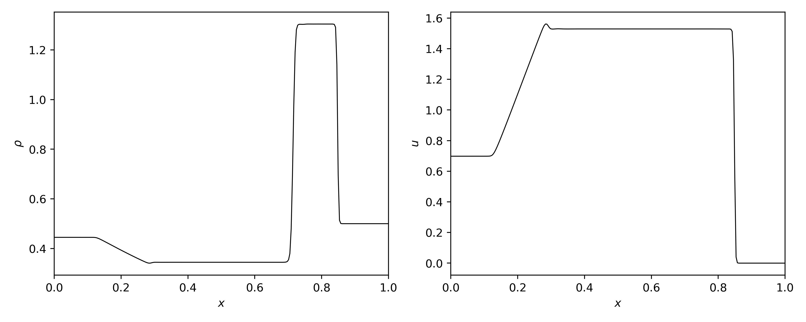
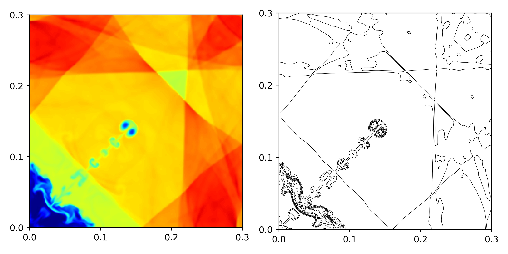
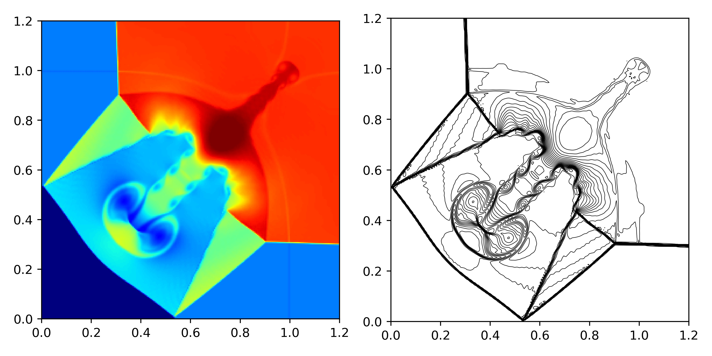
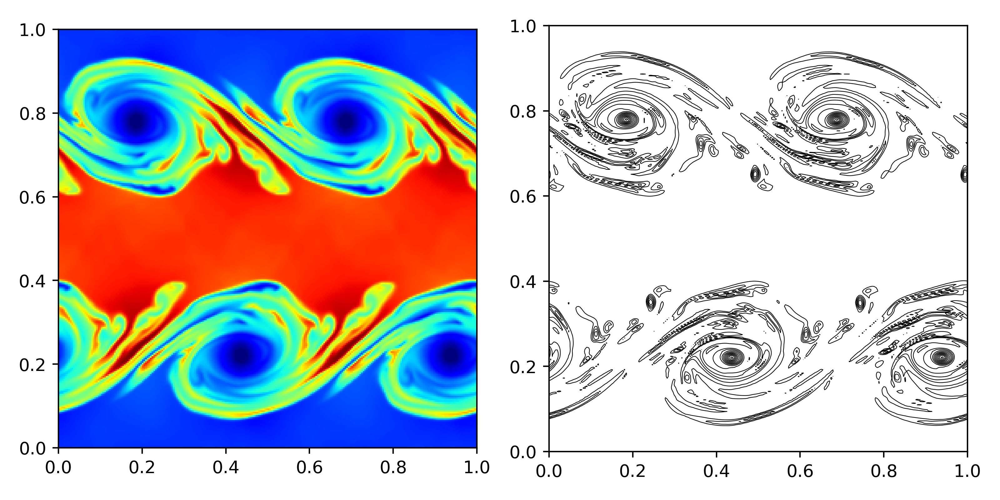

# Test Cases

<!-- ## ALPACA configuration -->
The test cases are simulated with following configuration in ALPACA.

src/user_specifications/compile_time_constants.h
```cpp
static constexpr unsigned int internal_cells_per_block_and_dimension_ = 64; 
```

src/user_specifications/riemann_solver_settings.h
```cpp
constexpr ConvectiveTermSolvers convective_term_solver = ConvectiveTermSolvers::FluxSplitting;
```
src/user_specifications/stencil.h
```cpp
constexpr ReconstructionStencils reconstruction_stencil = ReconstructionStencils::WENO7;
```

**The figures are only for demonstration. The cases are simulated with a high resolution. For benchmark testing, a lower resolution configuration is preferred, e.g. 64 cells.**


## Lax shock-tube problem

Refer to Lin's TENO5 paper.



## 2D implosion

Refer to "Numerical symmetry-perserving techniques for low-dissipation shock-capturing schemes" in Nico's thesis.



## 2D Riemann Problem

The vortical structures are noticeable if the resolution is [256, 256] and even higher.

Refer to 
- "Numerical symmetry-perserving techniques for low-dissipation shock-capturing schemes" in Nico's thesis.
- ["On the proper setup of the double Mach reflection as a test case for the resolution of gas dynamics codes"](pdf/kemm2016.pdf) for double mach reflection.



## Kelvin–Helmholtz instability

Refer to [Local Characteristic Decomposition Based Central-Upwind Scheme](https://arxiv.org/pdf/2206.08803.pdf)



## Taylor-Green vortex


